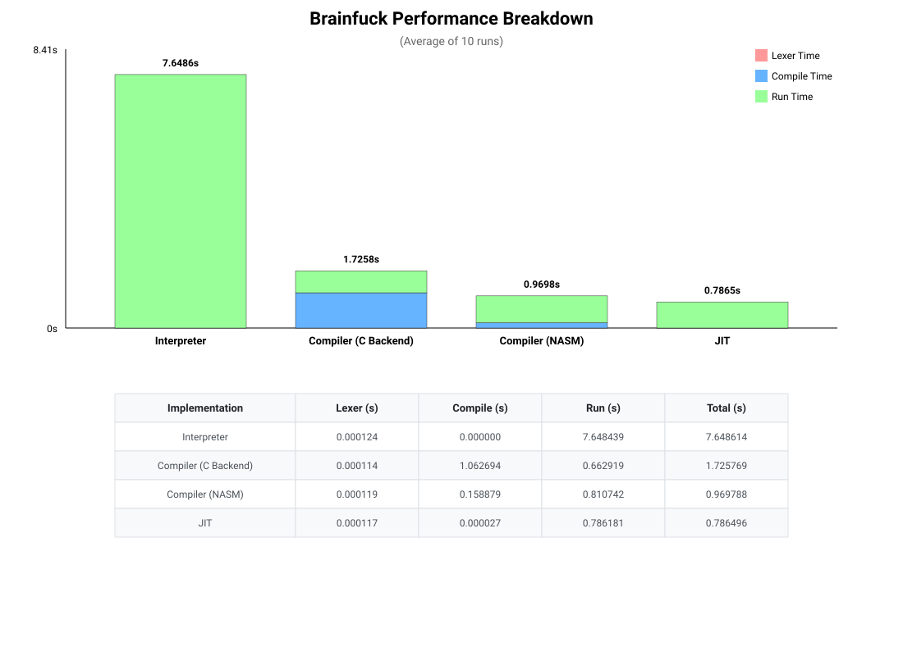

# Brainfuck Implementation

A project that takes a Brainfuck file and runs/compiles/jit.

## Usage

```
Usage: ./bin/bfc [OPTIONS] <BF-FILE>
OPTIONS:
    -help
        Print this help to stdout and exit with 0
    -metrics
        Show metrics
    -run
        COMPILER ONLY: Run the output executable
    -o <str>
        COMPILER ONLY: Output executable filename.
        Default: a.out
    -nasm
        ASM backend
    -c
        C backend
    -jit
        Just-In-Time compile and run the program
    -interpret
        Interpret and run the program
Use one of -c -nasm -jit -interpret
```

## Compiler

- **C Backend**: Using simple C code to generate the application
- **NASM Backend** (Use `-nasm`): Using NASM code to generate the application

## JIT

Using custom JIT library to Just-In-Time compile the code to x86-64 machine code.
Use `-jit`.
Data & Control-Flow implementation (same for the NASM backend):

- data-pointer: `rbx`
- calling std functions: `call rax`
- comparisons: `cmp [rbx], 0`

## Interpreter

A simple and dumb interpreter to run the application.
Use `-interpret`

# Examples

All the following runs will produce the same output.

```bash
./bin/bfc -interpret examples/mandelbrot.bf
./bin/bfc -c -o mandelbrot_c examples/mandelbrot.bf && ./mandelbrot_c
./bin/bfc -nasm -o mandelbrot_nasm examples/mandelbrot.bf && ./mandelbrot_nasm
./bin/bfc -jit examples/mandelbrot.bf

# Use -metrics to see compiler/runtime statistics :)
./bin/bfc -jit -metrics examples/mandelbrot.bf
```

# Benchmark

Graph showing the Compile Time and Runtime of all implementations.
The bench will run the  program and avg the results.


